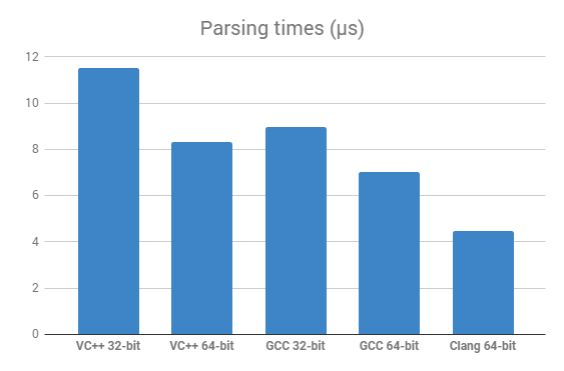

# croncpp
**THIS PROJECT IS UNDER DEVELOPMENT!**

croncpp is a C++17 header-only cross-platform library for handling CRON expressions. It implements two basic operations, parsing an expression and computing the next occurence of the scheduled time.

## CRON expressions
A CRON expression is a string composed of six fields (in some implementation seven) separated by a whites space representing a time schedule. The general form is the following (with the `years` being optional):

```
<seconds> <minutes> <hours> <days of month> <months> <days of week> <years>
```

The following values are allowed for these fields:

| Field | Required | Allowed value * | Allowed value (alternative 1) ** | Allowed value (alternative 2) *** | Allowed special characters |
| --- | --- | --- | --- | --- | --- |
| seconds | yes | 0-59 | 0-59 | 0-59 | `*` `,` `-` |
| minutes | yes | 0-59 | 0-59 | 0-59 | `*` `,` `-` |
| hours | yes | 0-23 | 0-23 | 0-23 | `*` `,` `-` |
| days of month | 1-31 | 1-31 | 1-31 | 1-31 | `*` `,` `-` `?` `L` `W` |
| months | yes | 1-12 | 0-11 | 1-12 | `*` `,` `-` |
| days of week | yes | 0-6 | 1-7 | 1-7 | `*` `,` `-` `?` `L` `#` |
| years | no | 1970-2099 | 1970-2099 | 1970-2099 | `*` `,` `-` |

\* - As described on Wikipedia [Cron](https://en.wikipedia.org/wiki/Cron)

** - As described on Oracle [Role Manager Integration Guide - A Cron Expressions](https://docs.oracle.com/cd/E12058_01/doc/doc.1014/e12030/cron_expressions.htm)

*** - As described for the Quartz scheduler [CronTrigger Tutorial](http://www.quartz-scheduler.org/documentation/quartz-1.x/tutorials/crontrigger)

The special characters have the following meaning:

| Special character | Meaning | Description |
| --- | --- | --- |
| `*` | all values | selects all values within a field |
| `?` | no specific value | specify one field and leave the other unspecified |
| `-` | range | specify ranges |
| `,` | comma | specify additional values |
| `/` | slash | speficy increments |
| `L` | last | last day of the month or last day of the week |
| `W` | weekday | the weekday nearest to the given day |
| `#` | nth |  specify the Nth day of the month |

Examples: 

| CRON | Description |
| --- | --- |
| * * * * * * | Every second |
| */5 * * * * ? | Every 5 seconds |
| 0 */5 */2 * * ? | Every 5 minutes, every 2 hours |
| 0 */2 */2 ? */2 */2 | Every 2 minutes, every 2 hours, every 2 days of the week, every 2 months |
| 0 15 10 * * ? * | 10:15 AM every day |
| 0 0/5 14 * * ? | Every 5 minutes starting at 2 PM and ending at 2:55 PM, every day |
| 0 10,44 14 ? 3 WED | 2:10 PM and at 2:44 PM every Wednesday of March |
| 0 15 10 ? * MON-FRI | 10:15 AM every Monday, Tuesday, Wednesday, Thursday and Friday |
| 0 15 10 L * ? | 10:15 AM on the last day of every month |
| 0 0 12 1/5 * ? | 12 PM every 5 days every month, starting on the first day of the month |
| 0 11 11 11 11 ? | Every November 11th at 11:11 AM |

## croncpp library

To parse a CRON expression use `make_cron()` as follows:

```
try
{
   auto cron = cron::make_cron("* 0/5 * * * ?");
}
catch (cron::bad_cronexpr const & ex)
{
   std::cerr << ex.what() << '\n';
}
```

To get the next occurence of the time schedule use the `cron_next()` function as follows:

```
try
{
   auto cron = cron::make_cron("* 0/5 * * * ?");
   
   std::time_t now = std::time(0);
   std::time_t next = cron_next(cron, now);   
}
catch (cron::bad_cronexpr const & ex)
{
   std::cerr << ex.what() << '\n';
}
```

Alternatively, you can use `std::tm` instead of `std::time_t`:

```
try
{
   auto cron = cron::make_cron("* 0/5 * * * ?");
   
   std::tm time = cron::utils::to_tm("2018-08-08 20:30:45");
   std::tm next = cron_next(cron, time);
}
catch (cron::bad_cronexpr const & ex)
{
   std::cerr << ex.what() << '\n';
}
```

When you use these functions as shown above you implicitly use the standard supported values for the fields, as described in the first section. However, you can use any other settings. The ones provided with the library are called `cron_standard_traits`, `cron_oracle_traits` and `cron_quartz_traits` (coresponding to the aforementioned settings).

```
try
{
   auto cron = cron::make_cron<cron_quartz_traits>("* 0/5 * * * ?");
   
   std::time_t now = std::time(0);
   std::time_t next = cron_next<cron_quartz_traits>(cron, now);   
}
catch (cron::bad_cronexpr const & ex)
{
   std::cerr << ex.what() << '\n';
}
```

## Benchmarks

The following results are the average (in microseconds) for running the benchmark program ten times on Windows and Mac with different compilers (all with release settings).

| VC++ 32-bit| VC++ 64-bit | GCC 32-bit | GCC 64-bit | Clang 64-bit |
| --- | --- | --- | --- | --- |
| 11.52 | 8.30 | 8.95 | 7.03 | 4.48 |

VC++ 15.7.4 running on 
* Windows 10 Enterprise build 17134
* Intel Core i7, 2.67 GHz, 1 CPU / 4 cores / 8 logical, 6 RAM
  
GCC 8.1.0 / Clang LLVM 9.1.0 running on
* macOS 10.13.5
* Intel Core i7, 1.7 GHz, 1 CPU / 2 cores, 8 GB RAM

